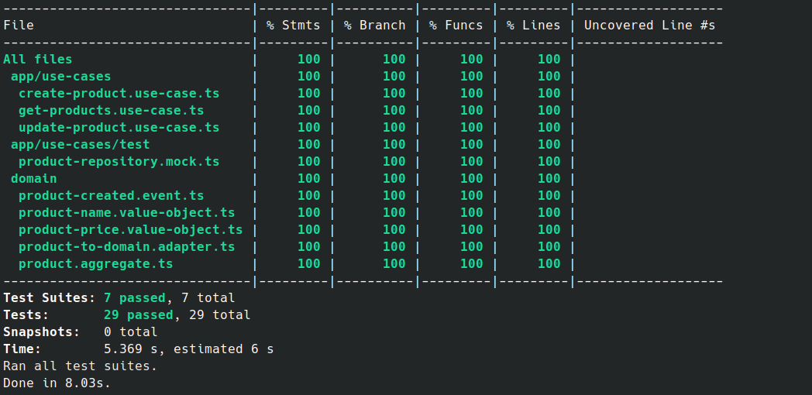
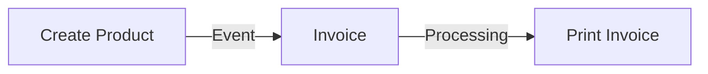

# DDD APP

## Simple App

App built using `types-ddd` v3 [Link Here](https://www.npmjs.com/package/types-ddd)

A minimum project to test the domain driven design lib



### How to run this app

- Install deps

```sh

$ yarn install

```

- Run the tests

```sh

$ yarn test

```

- Run the app

```sh

$ yarn dev

```

- Run integration tests

```sh

$ yarn test:e2e

```

- On your terminal run commands or copy curl to execute in postman*

```sh

# List products 

$ curl http://localhost:3000/products | jq '.'

```

```sh

# Create Product

$ curl -X POST -H "Content-Type: application/json" \
-d '{ "name": "valid", "price": 21.00 }' \
http://localhost:3000/products | jq '.'

```

```sh

# Update Product

$ curl -X PUT -H "Content-Type: application/json" \
-d '{ "name": "items", "price": 42.00 }' \
http://localhost:3000/products/:id | jq '.'


```

```sh

# List Invoices

$ curl http://localhost:3000/invoices | jq '.'

```


## Business Rules

When a product (Product Context) is created, an event is dispatched to the Invoice Context domain. The domain generates an invoice aggregate and validates business rules, then dispatches another event to its own context in the infrastructure to build and save the invoice.

