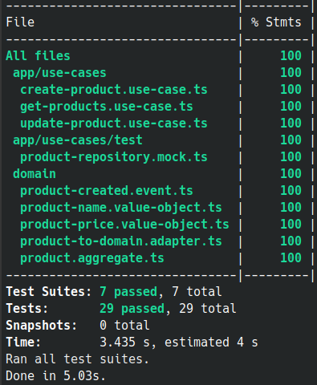

# DDD APP

## Simple App

App built using `types-ddd` v3 [Link Here](https://www.npmjs.com/package/types-ddd)

A minimum project to test the domain driven design lib



### How to run this app

- Install deps

```sh

$ yarn install

```

- Run the tests

```sh

$ yarn test

```

- Run the app

```sh

$ yarn dev

```

- Open your browser

```sh

# List products 

GET http://localhost:3000/products

```

```sh

# Create Product

POST http://localhost:3000/products
--data { name: "product name", price: 28.20 }

```

```sh

# Update Product

PUT http://localhost:3000/products/:id
--data { name: "new name", price: 42.00 }

```
